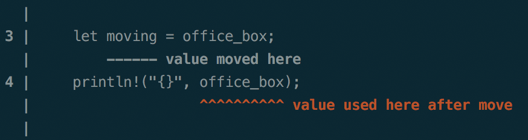

# Ownership in Rust

I recently starting learning Rust. I was attracted to the language because, at first glance, it promised an experience unlike what I've had with previous languages. It did not disappoint. For anyone beginning to learn Rust, you will read time and time again about the thing that makes Rust Rust: ownership. What is it?

Rust is frequently contrasted with C and C++. When programming in these languages, the programmer may use `free` and `delete` to remove objects on the heap as they will. The caveat being the programmer is also responsible for making sure objects are not referenced after removal from the heap.

Like C/C++, Rust allows control over the lifetime of objects. However, unlike C/C++, Rust does not risk dangling pointers. Ownership provides the programmer this control while also making the language safe.

Ownership has many variations. I want to point out a few of the most frequently encountered.

### Moving

Imagine that your friend recently moved apartments. She hired a moving company to haul some boxes around for her. In memory managed languages, it might look something like this:

```java
String kitchenBox = "kitchen";
String mover = kitchenBox;
System.out.println(kitchenBox);

<Output>
kitchen
```

She has a box which belongs in the kitchen, aptly labeled `"kitchen"`. With her moving company, she has every expectation that the movers will take the box, but she can retrieve it at any time. In languages such as this, both variables hold a pointer to the value, `"kitchen"`. Either may retrieve the value.

A few months go by and you find yourself in need of movers too. You ask your friend who she hired. You appreciate her recommendation, but you decide to give Rust a try.

```rust
let office_box = "office".to_string();
let mover = office_box;
println!("{}", office_box);
```
Oh dear, the Rust compiler throws an error:



The pointer to `"office"` which was originally owned by your `office_box` was *literally* moved to `mover`. In cases such as this, `office_box` is left invalidated. When you attempt to access it, nothing is there to actually access. It looks like the moving company just decided to keep your box. Great. In Rust terms, `mover` now owns the box.

When using the above syntax, values are moved when they are assigned to variables or passed into/returned from functions. Perhaps you should have specified a different arrangement with the moving company. Rust provides a few different options for this.

As a sidenote, `"office"` looks like a string in the Rust code above, yet we called `to_string` on it. What is going on here? At its core, Rust has a string type `str` which is often seen in a borrowed form `&str` (see next section for borrowing). The code above takes our `"office"` `str` and transforms it into an owned type, `String`.

### Borrowing

Instead of moving your pointer to a new owner, you should have specified that it should be borrowed. You can do this in Rust using `&`. The code below is almost the same as the previous code, but with an added `&` in the assignment to `mover`.

```rust
let office_box = "office".to_string();
let mover = &office_box;
println!("{}", office_box);

<Output>
office
```

The compiler might complain that the `mover` variable is unused, but it's just a warning. Unlike before, you will see `office` printed in your output. The `&` creates a reference that refers to our `String`, but does not own it. It is borrowed by our `mover`, but maintains its original ownership.

It is important to note that borrowing solely with `&` is immutable. There is, however, a mutuable version of borrowing: `&mut`.

```rust
let mut office_box = "office".to_string();
relabel(&mut office_box);
println!("{}", office_box);

fn relabel(your_box: &mut String) {
    your_box.clear();
    your_box.push_str("back office");
}

<Output>
back office
```

If we declare our `office_box` as `mut` (mutable) and borrow it as mutable with `&mut`, we can modify the value.

### Copy Types

Some simple types in Rust such as numeric, char, and boolean types implement the Copy trait. (Traits are a collection of methods for an unknown type. They are similar to interfaces in other languages.) For these types, borrow is not required because it is inexpensive to create duplicate values.

It is possible for your custom object to implement a very basic version of Copy using Rust's derive attribute:

```rust
#[derive(Copy, Clone)]
struct Example;
```

`Clone` is a supertrait of `Copy` and is required when using `Copy`.

Alternatively, you may implement Clone/Copy yourself. Note that, because memory safety is at the heart of the Rust language, `Copy` would not work on this struct if it contained other uncopyable types.

When I began learning Rust, I used `Copy` freely because I did not fully comprehend what I was doing. Copying your custom objects does use more memory in places where other options may have been sufficient. I would challenge anyone learning Rust to avoid using it until you get a feel for the language. In the words of Ben Parker, "With great power comes great responsibility."

### Lifetimes

Imagine you have this code again:

```rust
let office_box = "office".to_string();
```

What happens if a reference to this resource is borrowed, then somehow dropped by the owner `office_box` before the borrower attempts to access it? Without lifetimes, we would have a dangling reference, the very thing we've been attempting to avoid.

Lifetimes are a subset of ownership. They are used by the compiler to keep track of when it is safe to dereference a pointer. Most of the time, lifetimes can be elided; the compiler infers them. However, sometimes the compiler needs extra information to determine a lifetime. If required, they appear as `<'a>`, `<'b>`, etc. in a variety of arrangments in different method signatures.

In my Rust experience, I wish I had known some of the lifetime signatures sooner. These are a few I encountered the most:

* function: `fn example<'a>()`,
* struct: `struct Example<'a>`,
* implementation: `impl<'a> Example<'a>`

These make more sense the more you use Rust. You can see these patterns in the example below.

### An Example Usage

Anyone who has read the 8th Light blogs knows that 8th Light believes strongly in and practices test driven developement. In working with Rust, I went through many iterations trying to roll my own mock for user input. Eventually, I was able to combine a trait with lifetimes to create the mock struct below. It accepts a vector of `&str` and iterates through the vector on each call. The goal was to simulate repeated user input until valid input was entered. (The mock version stands in for a version which uses `BufRead`.)

```rust
pub trait Input {
    fn read_line(&mut self) -> String;
}

pub struct MockInput<'a> {
    input: Vec<&'a str>,
    called: usize,
}

impl<'a> Input for MockInput<'a> {
    fn read_line(&mut self) -> String {
        let index = self.called;
        self.called = self.called + 1;
        String::from(self.input[index])
    }
}

impl<'a> MockInput<'a> {
    pub fn new(input: Vec<&'a str>) -> MockInput<'a> {
        MockInput { input, called: 0 }
    }

    pub fn times_called(self) -> usize {
        self.called
    }
}
```

Notice that `self.called` is a `usize` (one of the standard Copy types) and does not require borrowing. We are however borrowing `&str`. As such, we need a way to say, "These `&str`s, they will last longer than the struct using them." This is why lifetimes are involved. The lifetimes ensure our values live longer than our mock input struct. Without this, it opens up the possiblity that our `&str`s may be deallocated before our struct accesses them. Again, dangling pointers. Rust is not A-OK with this. In cases such as this, the compiler will figure out what `<'a>` means as a lifetime; you just have to provide it.

Ownership has other nuances not described here and I encourage everyone to read more.
